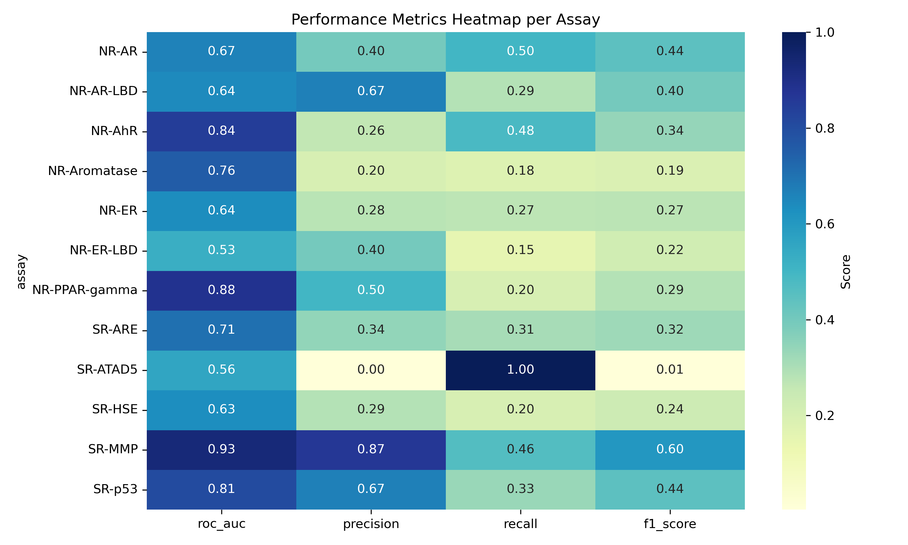
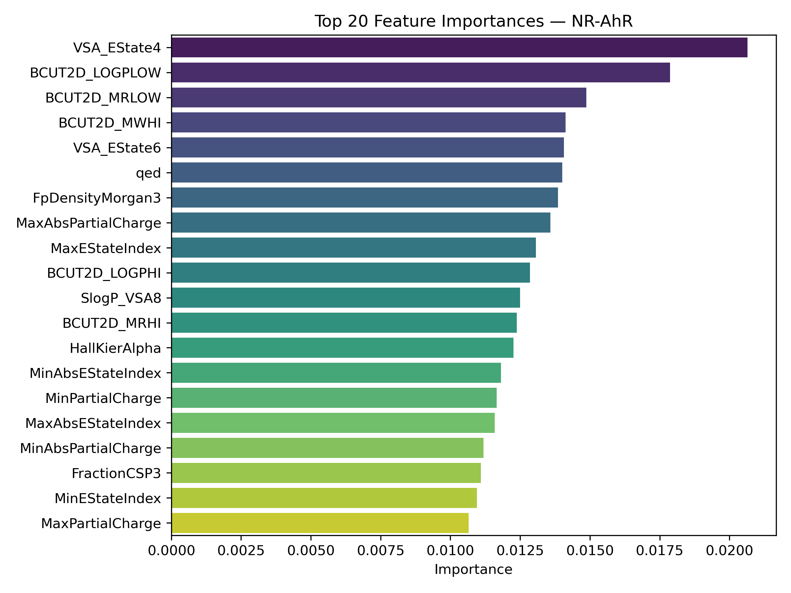
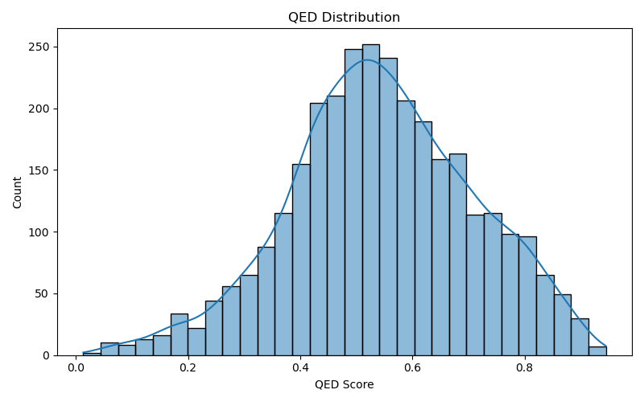
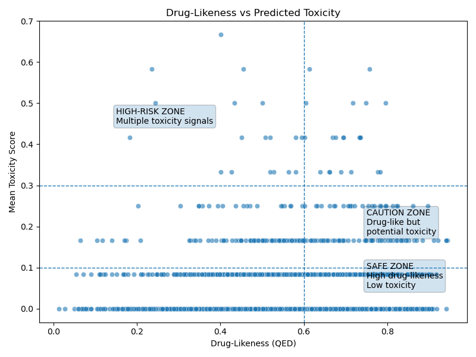
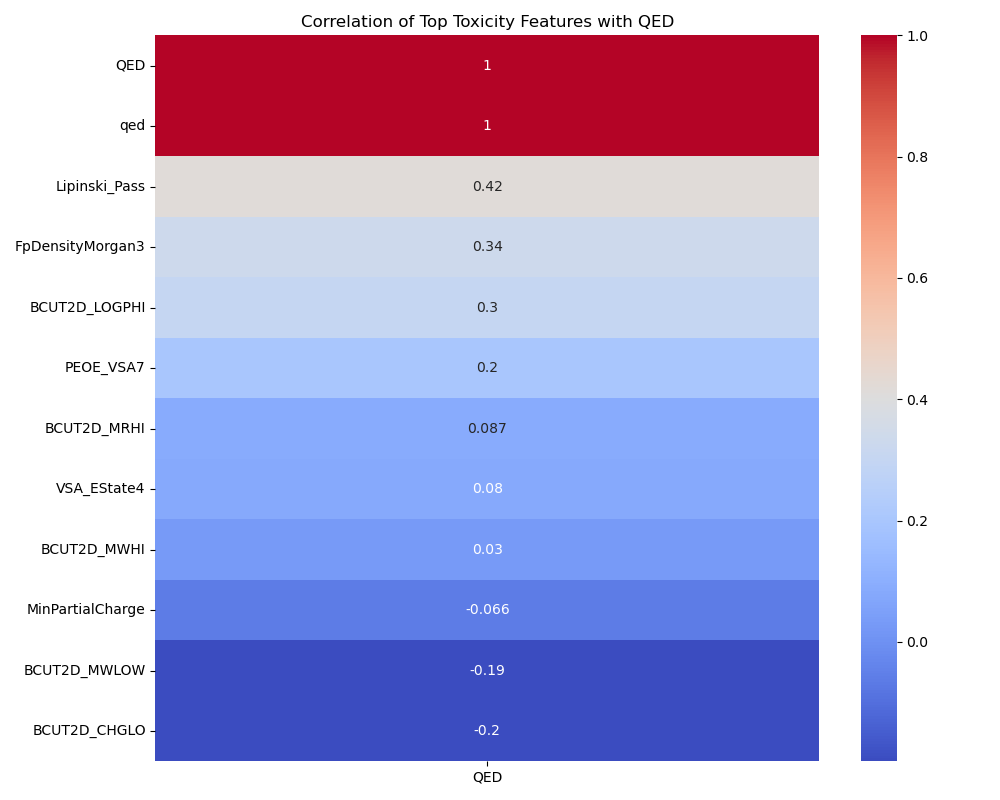

# 🧪 Drug-Likeness and Toxicity Prediction using Machine Learning

---
## Abstract

Early-stage drug discovery requires balancing **chemical developability** with **biological safety**, yet traditional drug-likeness heuristics alone fail to capture complex toxicity mechanisms. This project presents an integrated cheminformatics workflow that combines **machine learning–based toxicity prediction** with **medicinal chemistry metrics** to prioritize safer, drug-like compounds. Using the Tox21 dataset, multiple assay-specific classifiers were trained to learn structural patterns associated with toxicity pathways. These predictions were then unified with Lipinski’s Rule of Five and Quantitative Estimate of Drug-likeness (QED) to identify compounds occupying a high drug-likeness, low-toxicity region. The resulting framework demonstrates how interpretable machine learning models can support **risk-aware compound prioritization** in early drug discovery without making clinical or regulatory claims.

---
> ### Executive Summary
> - Built an end-to-end **cheminformatics and machine learning pipeline**
> - Trained **12 assay-specific toxicity classifiers** using Tox21
> - Integrated **Lipinski’s Rule of Five** and **QED** with ML predictions
> - Identified **50 high-confidence, drug-like, low-toxicity compounds**
> - Emphasized **interpretability, reproducibility, and responsible use**

---
## Table of Contents
- [Overview](#overview)
- [Scientific Motivation](#scientific-motivation)
- [Dataset](#dataset)
  - [Tox21](#tox21)
  - [ChEMBL 36](#chembl-36)
- [Modeling Approach](#modeling-approach)
- [Model Performance](#model-performance)
- [Model Interpretability](#model-interpretability)
- [Stage 9: Drug-Likeness & Toxicity Integration](#drug-likeness--toxicity-integration)
- [Ranking the Top 50 Safest Drug-Like Molecules](#ranking-the-top-50-safest-drug-like-molecules)
- [Why the Machine Learning Model Was Necessary](#why-the-machine-learning-model-was-necessary)
- [Model Scope & Limitations](#model-scope--limitations)
- [Reproducibility](#reproducibility)
- [Technologies](#technologies)
- [Final Note](#final-note)

---

## Overview

This project integrates **machine learning–based toxicity prediction** with **medicinal chemistry heuristics** to prioritize **safer, drug-like small molecules**.  
Using the **Tox21 dataset**, multiple assay-specific classifiers were trained to learn structural patterns associated with toxicity, and their predictions were combined with **Lipinski’s Rule of Five** and **QED (Quantitative Estimate of Drug-likeness)**.

> **Primary goal:**  
> Learn toxicity-relevant molecular patterns and demonstrate how ML predictions can be integrated with drug-likeness metrics for **early-stage compound prioritization**, not clinical toxicity prediction.

---

## Scientific Motivation

In early drug discovery:
- Drug-likeness ≠ safety  
- Toxicity is **multifactorial and non-linear**
- Experimental screening is costly and slow  

This project demonstrates how:
- Machine learning captures **latent toxicity signals**
- Drug-likeness heuristics alone are insufficient
- Integrated scoring enables rational **risk-aware prioritization**

---

## Dataset

### Tox21
- ~7,800 small molecules
- 12 binary toxicity-related assays:
  - **Nuclear Receptor (NR)** pathways
  - **Stress Response (SR)** pathways

Raw and processed data are stored in:
- [`data/raw/tox21.csv`](data/raw/tox21.csv)
- [`data/processed/`](data/processed/)

### ChEMBL 36
- Included as [`data/raw/chembl_36.sdf`](data/raw/chembl_36.sdf)
- Used to demonstrate **pipeline extensibility**
- *Not used for model training or evaluation*

**Note**

Some of the datasets in this repository are **too large to display on GitHub**. They need to be downloaded separately or generated locally.

### Included / Referenced Datasets

1. **Tox21 Dataset**
   - Raw CSV: `tox21.csv`
   - Source: [Tox21 on DeepChem](https://deepchemdata.s3-us-west-1.amazonaws.com/datasets/tox21.csv.gz)
   - Processed descriptors (`tox21_descriptors.csv`) are generated locally using RDKit.
   - Fingerprints (`tox21_morgan_fp.npy`) are generated locally using RDKit.

2. **ChEMBL 36**
   - SDF file: `chembl_36.sdf`
   - Source: [ChEMBL Database](https://www.ebi.ac.uk/chembl/)
   - Note: This file is **too large to view on GitHub**.

---

## Modeling Approach

### Molecular Representation
- RDKit-derived descriptors:
  - Physicochemical (MolWt, LogP, HBD, HBA)
  - Electronic (EState, BCUT)
  - Structural density (Morgan fingerprint density)

Descriptors stored at:  
[`data/processed/tox21_descriptors.csv`](data/processed/tox21_descriptors.csv)

### Machine Learning
- One binary classifier per assay
- Optimized decision thresholds
- Evaluation metrics:
  - ROC-AUC
  - Precision
  - Recall
  - F1-score

All model metrics are stored at:  
[`results/metrics/model_metrics.csv`](results/metrics/model_metrics.csv)

---

## Model Performance

### ROC-AUC Summary Across Assays

### Metrics Heatmap

**Top-performing assays:**
- SR-MMP (ROC-AUC = 0.93)
- NR-PPAR-gamma (ROC-AUC = 0.88)
- NR-AhR (ROC-AUC = 0.84)

Lower-performing assays reflect biological complexity and class imbalance rather than modeling failure.

---

## Model Interpretability

### Feature Importance (Example)

Across assays, consistently important features include:
- **QED**
- BCUT descriptors (charge, lipophilicity)
- EState and VSA-based descriptors

Aggregated feature importances are stored at:  
[`results/metrics/feature_importances.csv`](results/metrics/feature_importances.csv)

---

## Drug-Likeness & Toxicity Integration

### Drug-Likeness Scoring
- Lipinski’s Rule of Five (pass/fail)
- Quantitative Estimate of Drug-likeness (QED)

**Distribution of QED scores:**

---

### Toxicity vs Drug-Likeness Overlay

**Interpretation:**
- **Safe zone:** High QED + Low predicted toxicity
- **Caution zone:** Drug-like but potential toxicity signals
- **High-risk zone:** Multiple toxicity pathway activations

This visualization demonstrates why **drug-likeness alone is insufficient**.

---

### Feature–QED Correlation

Several top toxicity-driving descriptors show **negative correlation with QED**, suggesting partial antagonism between toxicity drivers and developability.

---

## Ranking the Top 50 Safest Drug-Like Molecules

Final prioritization criteria:
- Lipinski compliant
- High QED
- Zero predicted toxicity across all assays

Results saved to:  
[`results/top_50_safest_druglike_molecules.csv`](results/top_50_safest_druglike_molecules.csv)

**Summary (Top 50):**
- Mean QED ≈ 0.88  
- Mean toxicity score = 0.00  

Molecules are identified by **SMILES**, as Tox21 does not provide compound names.

---

## Why the Machine Learning Model Was Necessary

> Could safer compounds be prioritized without ML?

**Only superficially.**

- Drug-likeness heuristics do not encode biological toxicity mechanisms
- ML captures **non-linear interactions** between descriptors
- The model enables **pattern discovery**, not simple filtering

---

## Model Scope & Limitations

- Binary assay endpoints
- No dose–response modeling
- No clinical interpretation
- No regulatory claims

This is an **exploratory, methodological project** aligned with early-stage computational screening.

---

## Reproducibility

Key notebooks:
- [`notebooks/01_data_exploration.ipynb`](notebooks/01_data_exploration.ipynb)
- [`notebooks/02_descriptor_generation.ipynb`](notebooks/02_descriptor_generation.ipynb)
- [`notebooks/03_modeling.ipynb`](notebooks/03_modeling.ipynb)
- [`notebooks/03B_interpretation.ipynb`](notebooks/03B_interpretation.ipynb)
- [`notebooks/05_drug_likeness_and_toxicity_integration.ipynb`](notebooks/05_drug_likeness_and_toxicity_integration.ipynb)

Dependencies listed in:  
[`requirements.txt`](requirements.txt)

---

## Technologies
- Python 3.10
- RDKit
- scikit-learn
- pandas / NumPy
- matplotlib / seaborn

---

## Final Note

This project demonstrates:
- End-to-end ML pipeline design
- Domain-aware feature engineering
- Responsible interpretation of predictive models
- Integration of machine learning with medicinal chemistry principles

It reflects **industry-aligned cheminformatics practice**, not clinical prediction.
